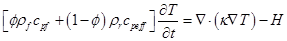

# SILLi 1.0
A 1D Numerical Tool Quantifying the Thermal Effects of Sill Intrusions

### Introduction

SILLi 1.0 is a user-friendly 1D FEM based tool which calculates the thermal effects of sill intrusions on the enclosing sedimentary stratigraphy and can be globally applied. Input data for the model is the present-day well log or sedimentary column with an Excel input file and includes rock parameters such as thermal conductivity, total organic carbon (TOC) content, porosity, and latent heats. The model accounts for sedimentation and burial based on a rate calculated by the sedimentary layer thickness and age. Erosion of the sedimentary column is also included to account for realistic basin evolution. Multiple sills can be emplaced within the system with varying ages.

The model output includes the thermal evolution of the sedimentary column through time, and the changes that take place following sill emplacement such as TOC changes, thermal maturity, and the amount of organic and carbonate-derived CO2. The TOC and vitrinite results can be readily benchmarked within the tool to present-day values measured in the sedimentary column. This allows the user to determine the conditions required to obtain results that match observables and leads to a better understanding of metamorphic processes in sedimentary basins.

### Governing Equation

The governing equation is the 1D heat diffusion equation:

 
Where <I>cpeff</I> is the effective rock heat capacity that includes the latent heat of crystallization for the sill and <I>H</I> accounts for the latent heat of dehydration in the surrounding sedimentary rock.

### Examples

The model is accompanied by three case studies of sills emplaced in two different sedimentary basins, the [Karoo Basin](/tutorials/karoo.md) in South Africa and the [Vøring Basin](/tutorials/utgard.md) offshore Norway. An additional example of emplacement of an [igneous intrusion into a pluton](/tutorials/pluton.md) is also shown for cases where basin evolution is not required.

### Further Reading
A full description of the model with examples can be found [here](https://www.geosci-model-dev-discuss.net/gmd-2017-132/).
