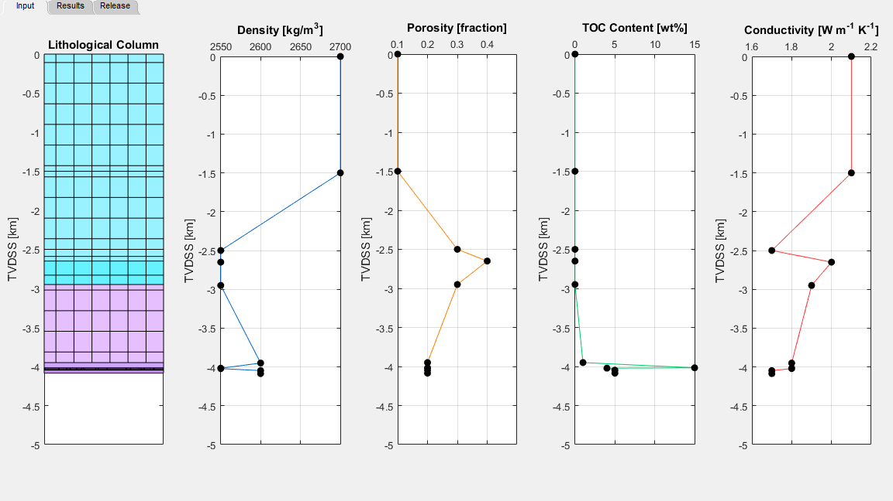
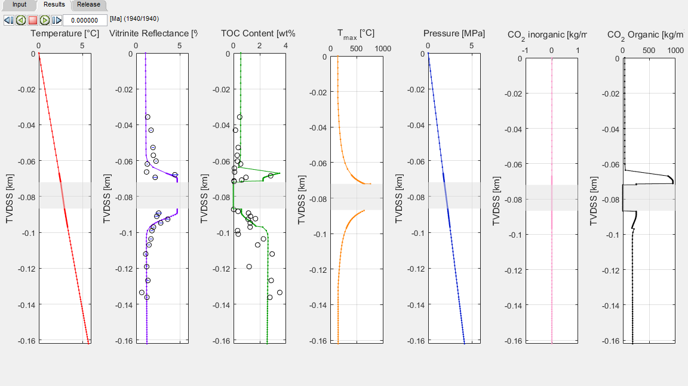
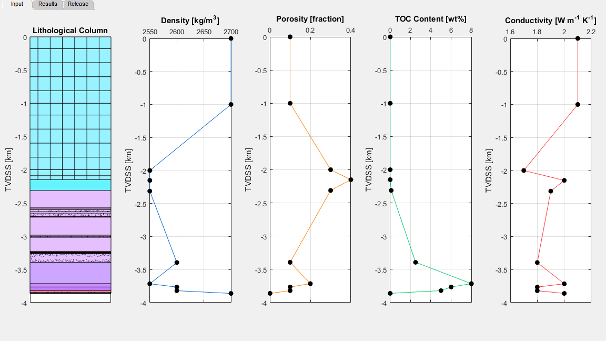
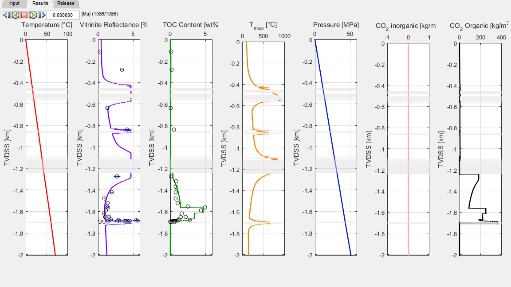

# Karoo Large Igneous Province (South Africa)

The Karoo Large igneous province was emplaced through the Karoo Basin in South Africa in the Early Jurassic. The basin contains sills and dykes of varying thickness emplaced at about 182.6 Ma. The basin stratigraphy consists of the Upper Carboniferous to the Triassic Karoo Supergroup and is divided in five groups (the Dwyka, Ecca, Beaufort, Stormberg and Drakensberg groups) with a postulated maximum cumulative thickness of 12 km and a preserved maximum thickness of 5.5 km. The depositional environments of the sediments range from marine and glacial (the Dwyka Group), marine to deltaic (the Ecca Group), to fluvial (the Beaufort Group) and finally eolian (the Stormberg Group). The Karoo Basin is overlain by 1.65 km of preserved volcanic rocks of the Drakensberg Group, consisting mainly of stacked basalt flows erupted in a continental and dry environment. Here we present two borehole cases from the central (borehole KL1/78) and eastern (borehole LA1/68) parts of the basin previously studied and modelled by Aarnes et al. (2011) and Svensen et al. (2015), respectively. The details regarding the relative timing of sill emplacement is poorly constrained and we thus use the same age for all sills. If the sills are closely spaced, this will result in a higher maximum temperature in the sedimentary rocks between the sills. For the erosion history of the Karoo Basin, we refer to Braun et al. (2014) and a rapid Late Cretaceous erosion event.

### Example 1: Karoo KL1/78
The first example from the Karoo Basin is a short borehole with a length of 136 m that penetrates the Tierberg, Whitehill and Prince Albert Formations. However, these Formations underlie a massive erosion sequence consisting of 2.5 km of extrusives (Drakensberg Group) and 1.5 km of sediments (Stormberg and Beaufort Groups) and are also included in the model. The borehole penetrates a single 15m thick sill at a depth of 72m (Figure 1). The sill is emplaced within the Prince Albert Formation at 182.6 Ma at a temperature of 1150°C. Initial average TOC data for the sedimentary layers is not known but can be roughly estimated using present-day values. The initial TOC data is subsequently refined so that a better match of the model results to the observed data is obtained, thereby highlighting how the model can be used to constrain initial conditions within the sedimentary column (Figure 2). The importance of considering the entire basin history when constructing the model is also emphasized by the VR results. The values of the VR results unaffected by the sill would be much lower than the observed values if the eroded sequences are not considered. Addition of these layers to the model results in added burial than would be expected than by just using the 136 m deep borehole. This translates the VR curve laterally thereby better fitting the observed values (Figure 2).  The final model shows a good fit of TOC and VR to present day values. Model input data can be found in [‘1d_sill_input_kl178.xlsx’](../examples/1d_sill_input_kl178.xlsx).

##### Figure 1: Input for KL1/78.
 
 

##### Figure 2: Results at the end of simulation time for KL1/68 shows a good match to present-day TOC and VR values.
 
 

### Example 2: Karoo LA1/68
The second example from the Karoo Basin is a borehole with a length of 1711 m that penetrates the basin down to the basement. Additional erosional sequence consisting mostly of the Drakensberg lavas and a minor section of the Stormberg Group is also added. The borehole penetrates multiple sills throughout the entire column with thicknesses ranging from 2 to 132m (Figure 3). Initial average TOC data for the sedimentary layers is estimated from present-day values. Similar to the previous example, material properties are iteratively changed within realistic bounds to arrive at an initial setup that matches the final observations well (Figure 4).  Model input data can be found in [‘1d_sill_input_la168.xlsx’](../examples/1d_sill_input_la168.xlsx).

##### Figure 1: Input for LA1/68.
 
 

##### Figure 2: Results at the end of simulation time for LA1/68 shows a good match to present-day TOC and VR values.
 
 

Aarnes, I., Svensen, H., Polteau, S., and Planke, S.: Contact metamorphic devolatilization of shales in the Karoo Basin, South Africa, and the effects of multiple sill intrusions, Chemical Geology, 281, 181-194, 2011.

Braun, J., Guillocheau, F., Robin, C., Baby, G., and Jelsma, H.: Rapid erosion of the Southern African Plateau as it climbs over a mantle superswell, Journal of Geophysical Research: Solid Earth, 119, 6093-6112, 2014.

Svensen, H. H., Planke, S., Neumann, E.-R., Aarnes, I., Marsh, J. S., Polteau, S., Harstad, C. H., and Chevallier, L.: Sub-Volcanic Intrusions and the Link to Global Climatic and Environmental Changes, 2015. 2015.
