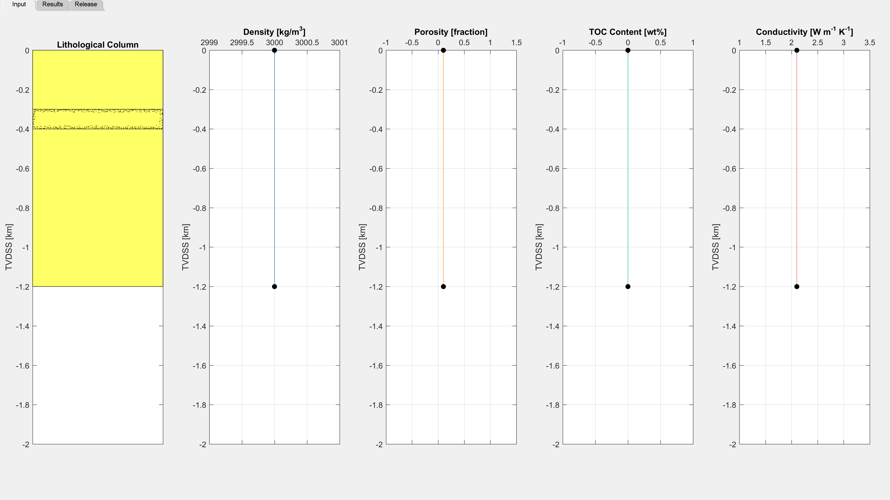
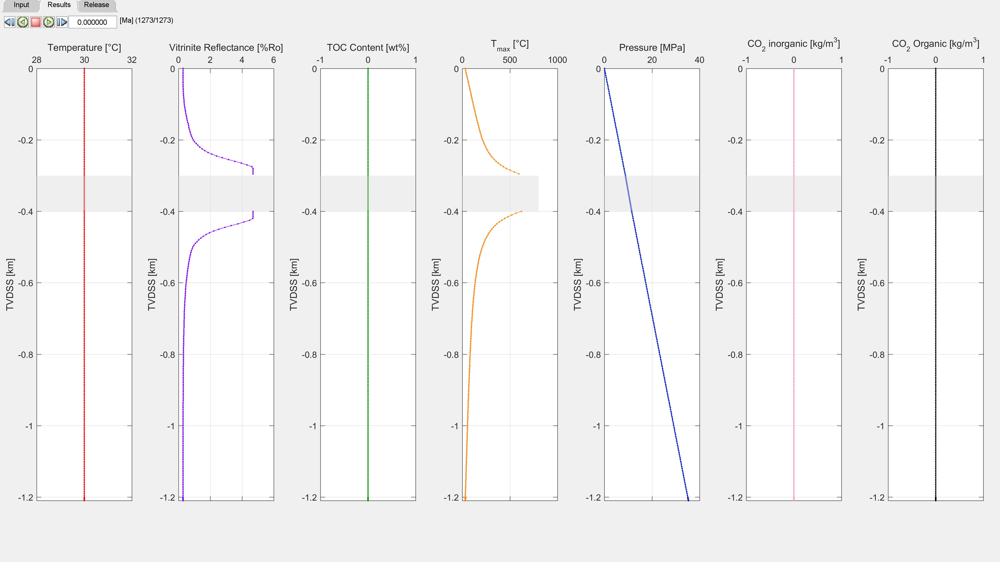

# Intrusion into a Pluton

This example has been added to provide an instance where the user may be interested in modelling the thermal aureole of an emplaced sill or dyke but without the effects associated with deposition of sedimentary layers and the thermal evolution of a basin, e.g. emplacement within an igneous or metamorphic rock. Here, we consider an emplacement of a 100m thick sill into a 1.2km thick igneous body that has cooled to a uniform temperature of 30°C (Figure 1). The host rock is constructed by defining a top and bottom layer with the same material properties and ages that are very close to each other (the code does not allow for two layers with the exact same age). In this example the top and bottom layers have ages of 10 and 10.0001 Ma, respectively, and the intrusion is emplaced at 1 Ma. A constant temperature for the host rock is defined by assigning the same temperature, 30°C, to both intervals in the temperature tab of the excel input file. Thus, the thermal evolution of the intrusion can be investigated independent of burial effects of a sedimentary basin if so desired (Figure 2). Further information about the model setting can be found in the input file ‘1d_sill_input_dyke.xlsx’.

##### Figure 1: Input for the Pluton example.
 
 

##### Figure 2: Results tab at the end of simulation time for the pluton example. VR and TOC data are not present for this hypothetical case.
 
 