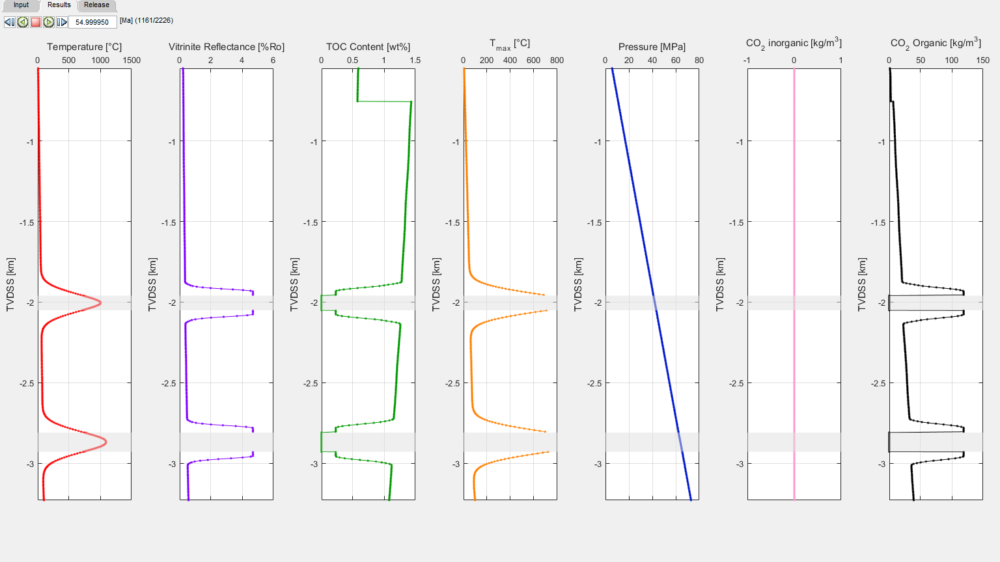

# The Utgard High (Norway)

The Utgard sill complex is part of the North Atlantic Igneous Province (NAIP) in the Vøring and Møre Basins, offshore Norway. This region underwent massive volcanic activity at the Paleocene-Eocene boundary around ~55 Ma (Aarnes et al., 2015). The Utgard High borehole 6607/5-2 was drilled through two sills emplaced in the Upper Cretaceous sedimentary layers. The drilled lithological column consists of nine layers with the oldest being deposited 100 Ma ([NPD Factpages](http://factpages.npd.no/factpages/)) (Figure 1). For simplicity, the material properties of the entire sedimentary column is set to constant values with the exception of TOC content. TOC content of the Paleocene and Upper Cretaceous sedimentary layers are set to an initial value of 0.6 and 1.5 wt%, respectively. Carbonate and erosional layers are not considered. The modelled sedimentary layers are sequentially deposited at the sedimentation rate calculated from the layer top ages. The two sills are emplaced simultaneously within the Nise and Kvitnos Formations at 55 Ma at a temperature of 1150°C. Sedimentary rocks around the emplaced sills are progressively heated as the sills cool. The vitrinite reflectance values increase and the TOC content reduced by thermally degrading organic matter to form CO2 (Figure 2). Sedimentation after sill emplacement results in further burial and extension to produce the present-day sedimentary column. Vitrinite reflectance and TOC data from the Norwegian Petroleum Directorate (NPD) and a previous study (Aarnes et al., 2015) are used to benchmark the model and match very well with the modelled results (Figure 3). Further information about the geological and model setting can be found in Aarnes et al. (2015) and the input file [‘1d_sill_input_utgard.xlsx’](utgard/1d_sill_input_utgard.xlsx).

##### Figure 1: Input for the Utgard High example.
 
 

##### Figure 2: Results for 50 years after the emplacement of sills at 55 Ma for the Utgard High example. Sediments around the sills are heated and CO2 is liberated as organic matter is thermally degraded.
 
 

##### Figure 3: Results at the end of simulation time for the Utgard High example. The present-day VR and TOC values (circles) show a good match with the model results.
 
 

Aarnes, I., Planke, S., Trulsvik, M., and Svensen, H.: Contact metamorphism and thermogenic gas generation in the Vøring and Møre basins, offshore Norway, during the Paleocene–Eocene thermal maximum, Journal of the Geological Society, doi: 10.1144/jgs2014-098, 2015. 588-598, 2015.
